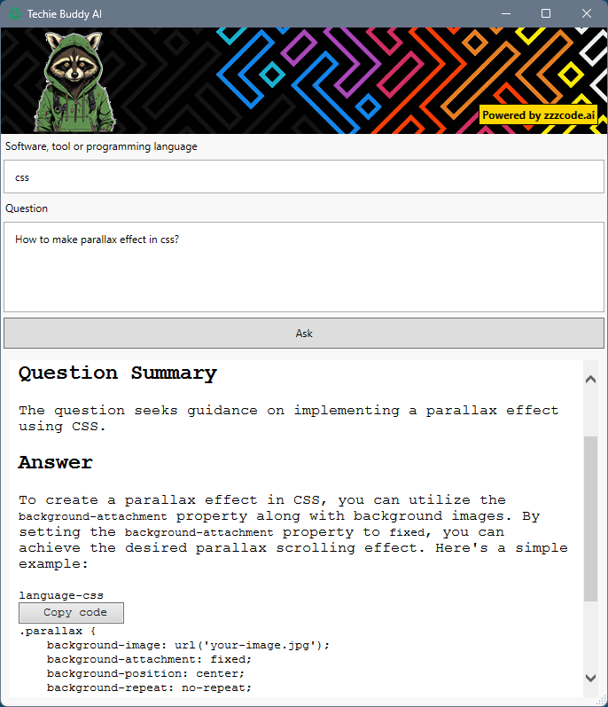

# Techie Buddy AI

## Overview

**Techie Buddy AI** is your go-to tool for answering questions about software, tools, or programming languages. Powered by [ZZZcode AI](https://zzzcode.ai/), a comprehensive platform for all aspects of coding
## Features

- Instant answers to questions about software, tools, or programming languages.
- Natural language understanding for intuitive interaction.
- Fast and reliable responses powered by machine learning.

## How it Works

**Techie Buddy AI** leverages the capabilities of [ZZZcode AI](https://zzzcode.ai/) to understand and respond to queries related to software, tools, and programming languages. It utilizes cutting-edge natural language processing models to analyze and generate responses based on the input questions.

### Requirements

- [.NET Framework version or any other dependencies]